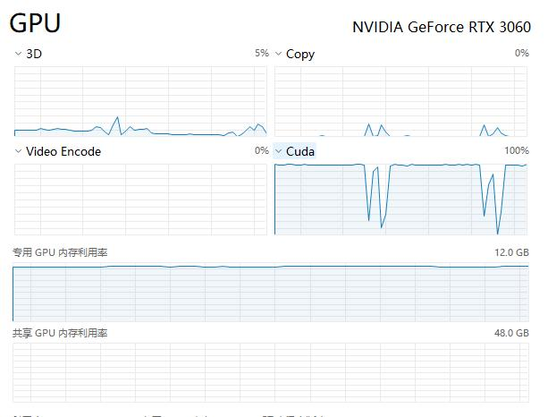

# Pytorch使用中遇到的一些性能问题的坑  

使用GPU训练模型时出现性能达不到90%以上，当并不是网络太简单或数据太少时要分析其不能跑满的原因。网上一般能找到的都是增加DataLoader的缓存、使用内存缓存数据等提升pytorch的效率。但经实际使用发现一些坑。  

## GPU中的评价指标导致性能下降  

在训练过程中使用item()、detach()命令时会导致GPU同步，破坏了其异步处理机制，从而导致性能下降严重。经测试可以导致GPU的CUDA使用率从100%降到50%~60%。  

当在训练时计算了loss以及accuracy等指标时，如果使用item()会导致GPU同步处理，GPU的处理效率下降30%~50% 。可在训练时记录其tensor，在需要打印时再使用item()。  

因此，如果一定要打印指标进行查看，建议只在每个epoch结束时打印一次。这样可以有效的降低GPU同步次数，尽可能让GPU异步快速处理。  
  
